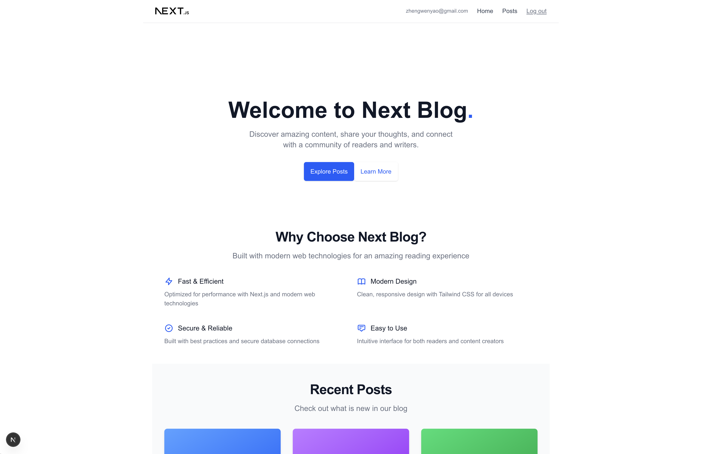
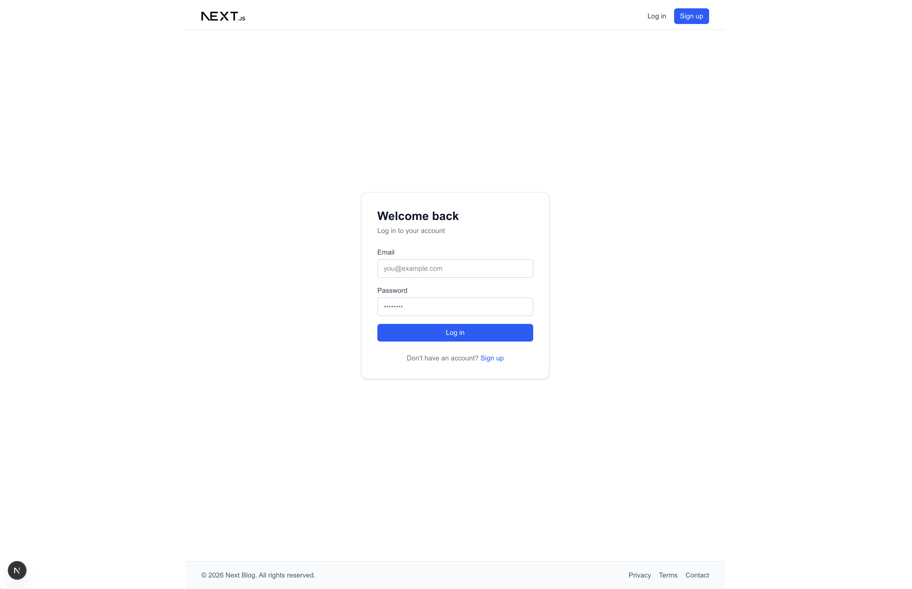
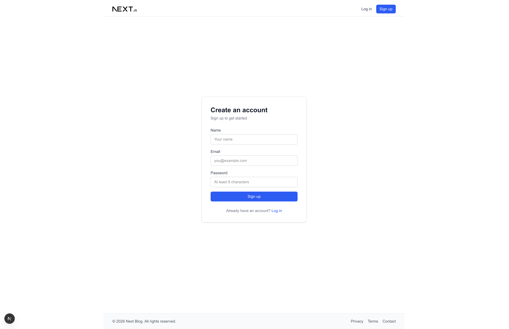
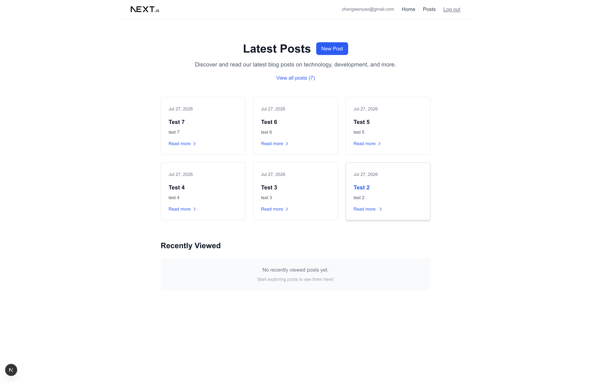
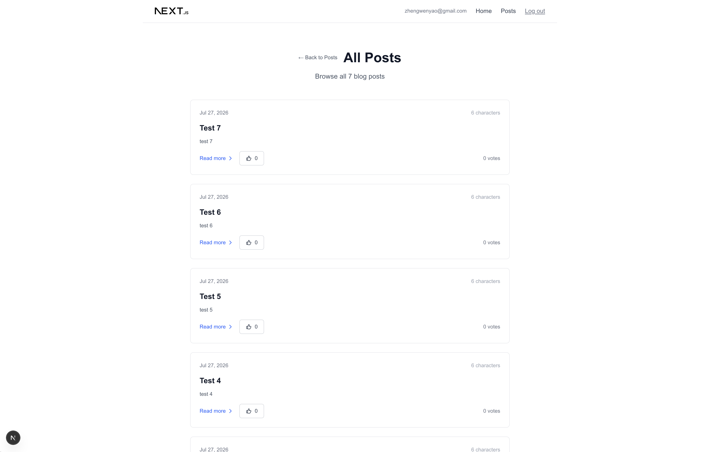
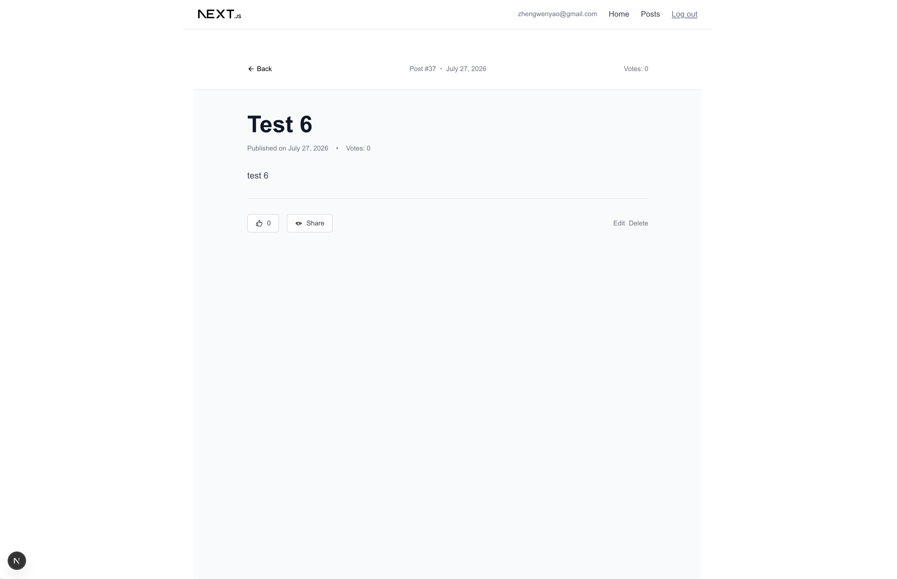
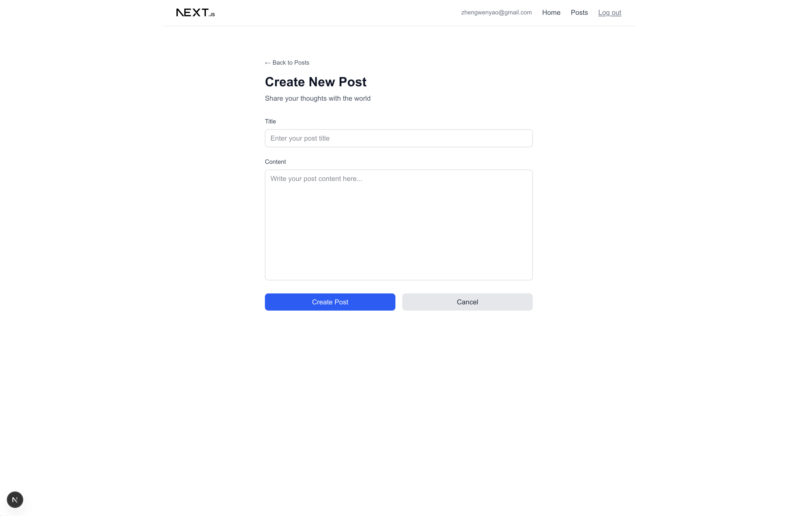
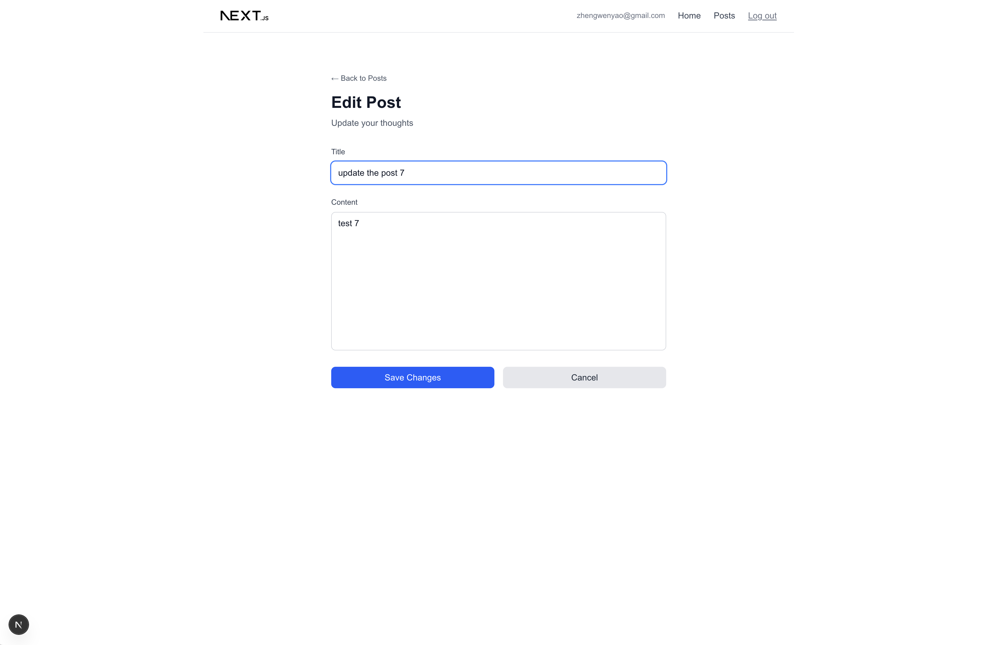

# Blog Site

A full-stack blog application built to practice and demonstrate modern web development skills — covering routing, database design, server actions, and UI implementation.

## Tech Stack

- **Framework:** Next.js (App Router)
- **Language:** TypeScript
- **Database:** SQLite + Prisma ORM
- **Styling:** Tailwind CSS
- **UI Components:** shadcn/ui

## Features

- 📝 Browse and read blog posts
- 🗂️ Archive page for older posts
- ⬆️ Upvote system for posts
- 🕒 Recently viewed posts tracking
- ✍️ Create new posts

## Screenshots

_1.Home page_



_2.Login page_


_3.SignUp page_


_4.Post detail - header info_



_5.Post detail - content_



_6.Post detail - upvote & actions_



_7.Create post page_



_8.Edit post page_



## Getting Started

```bash
git clone <https://github.com/SolDev08/blog-site.git>
cd blog-site
npm install
cp .env.example .env
npx prisma migrate dev
npm run dev
```

Open [http://localhost:3000](http://localhost:3000).

## Project Structure

```
app/
  posts/            # Post pages (list, detail, archive, new)
  api/posts/        # API routes
components/         # Reusable UI components
lib/
  types/            # Shared TypeScript types
  utils/            # Utility functions
  actions.ts        # Server actions
  prisma.ts         # Prisma client instance
prisma/
  schema.prisma     # Database schema

```

## Technical Highlights

- Implemented server-side data fetching with Prisma and proper type-safe query parameters
- Built reusable, type-safe components (e.g. upvote button with optimistic UI updates)
- Structured layout with nested routing and dynamic segments (\`[id]\`)
- Handled edge cases around interactive elements nested inside navigational links

## About This Project

Built as a personal project to strengthen full-stack fundamentals — from database schema design to frontend component architecture.
